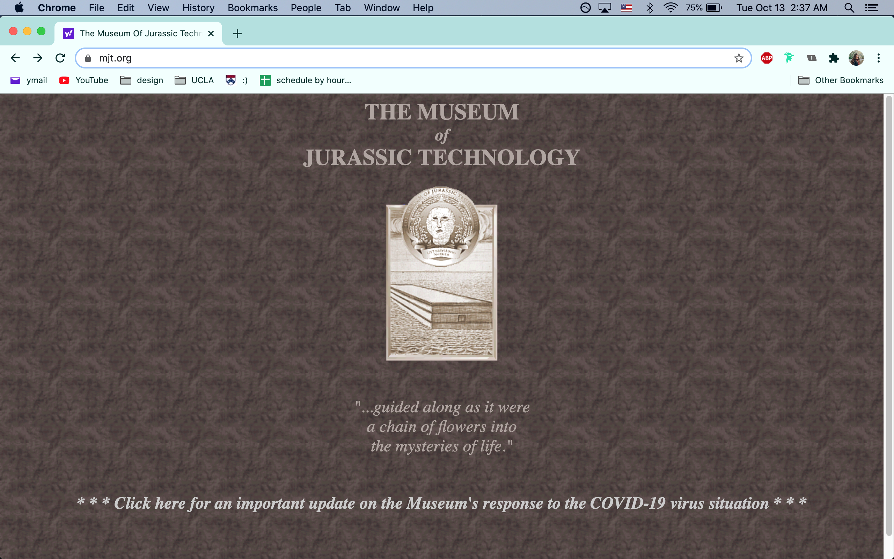
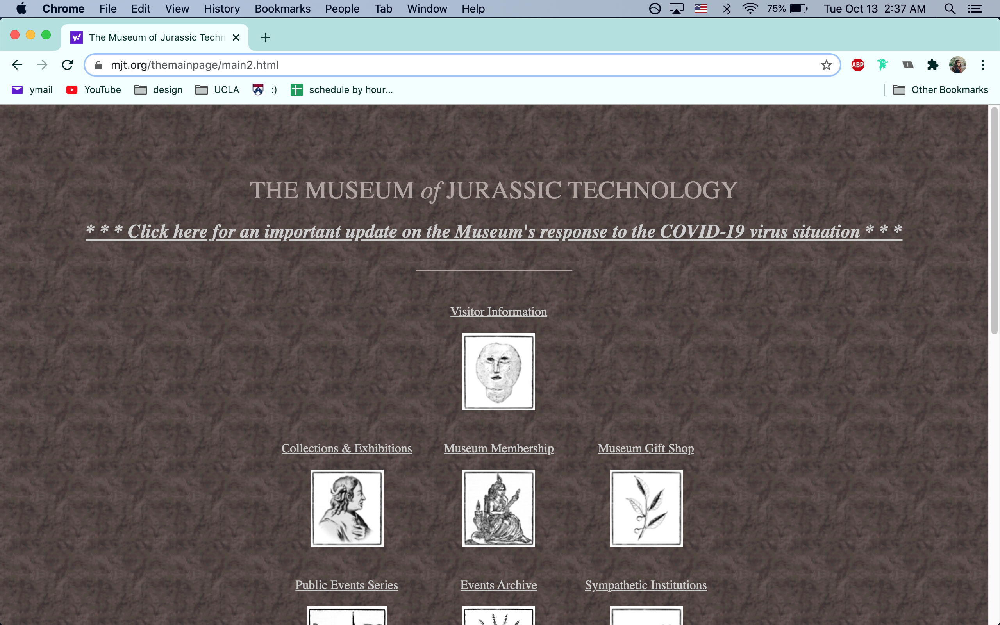
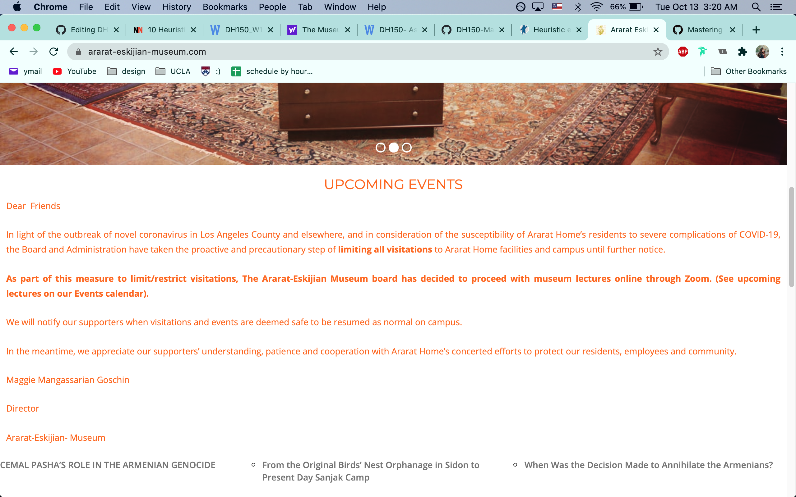
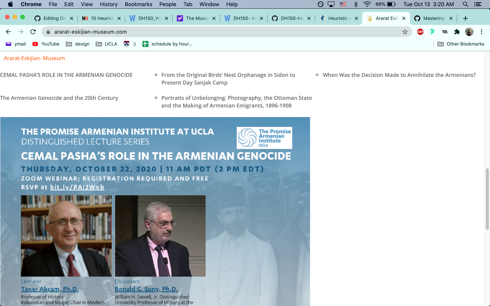

# A Heuristic Evaluation of the Websites of Small Museums
## Natalie Mazmanian 
### Course: Digital Humanities 150 

#### General Project Description:   

Designing with the theme of the well-being of middle-aged women in mind, I turned for inspiration to two of the most prominent middle-aged women in my own life: my mother, Nora, and her close friend, Maggie.  Maggie is the director of the Ararat-Eskijian Museum, a museum in Los Angeles which "aims to enrich, inspire and educate the [Armenian] community through the display of cultural artifacts, educational programs, and research archives that  share the history and heritage of the Armenian people."  Over the past few years, my mother has continually volunteered at the museum, and now serves as its treasurer.

You might be wondering: how does a niche museum have anything to do with the well-being of middle-aged women? 
And to that I say:
1. As people grow older, they tend to focus on what is most important. Perserving one's cultural heritage is a core value for many people, including my mother (and me!).
2. Many middle-aged women are mothers to adult children. As duties of motherhood subside, volunteering/museum-going in general is a wonderful (and research-backed) strategy to stay active within one's community. Staying active and social is directly linked to one's mental well-being.

Now that you know why we're doing this, it's time to tell you what we're doing. I'm going to heuristically evaluate two museum websites to determine how the design could have better been executed. I will be referncing the [10 Usability Heuristics for User Interface Design](https://www.nngroup.com/articles/ten-usability-heuristics/) from NN/g.  More accessible, enjoyable, and useful websites will likely encourage more women (and everyone else) to visit and volunteer at small museums.

## Website 1: The Museum of Jurassic Technology

[The Museum of Jurassic Technology Website](http://mjt.org)

Home page:  
  
  
  
After clicking on the central image:
  
  

### Brief Description of The Museum of Jurassic Technology Website:  
The Museum of Jurassic Technology is one of the most peculiar places I have ever been. The museum itself feels like a fever dream; and to an extent, the website does as well. The website opens to a home page with very little information aside from the name of the museum, the museum's logo, a quote, and an announcement regarding COVID-19. Clicking on the logo leads to a website arragned in a skeumorphic fashion, looking like a gallery itself.  Relevant visitor information, as well as exhibit information, can be found on subpages which can be arrived at by clicking on the corresponding image.

  

### Overall Evalation of The Museum of Jurassic Technology Website:  
The archaic aesthetic of the website and poor color accessibility contributes to an overall feeling of ... dustiness. The website evokes a mood of mysticism, as well as a lack of technological advancement. Overall, many heuristics of user interface design were overlooked. Although the website offers valuable information, it could be conveyed in a much more human-centered way.   
  
The following chart separately analyzes each heuristic, along with a severity rating from 1-3 (1 = aesthetic problem only, 2 = minor usability problem, 3 = major usability problem: important to fix/top priority).  

Heuristic | Evaluation | Severity
------------ | ------------- | -------------
#1: Visibility of system status | :-1: It is hard to determine the visibility of system status when hovering over the central logo/image. This poses a problem, as clicking on this graphic is what allows the user to advance to the actual relevant portion of the website.   :wrench: When hovering over the graphic, some indication should tell the user that there is a clickable action — perhaps a change in color could ensure better visibility of system status. | 2
#2: Match between system and the real world | Content in the second column | 3
#3: User control and freedom | Content | 3
#4: Consistency and standards | Content | 3
#5: Error prevention | Content | 3
#6: Recognition rather than recall | Content | 3
#7: Flexibility and efficiency of use | Content | 3
#8: Aesthetic and minimalist design | :-1: Take one look at this website and you will know that very little time was spent on ensuring a pleasurable visual interface. Not only is the entire website aesthetically outdated, but much information is presented that is not relevant to the user's goal at certain points of traversing the website.  For example, the quote on the landing page of the website distracts from more relevant information.   :wrench: I'm not suggesting that there be no quotes, but placing less important information on subpages could aid in a more cohesive design. Not to mention, a complete revamp of the look of the site would certainly increase usability from a visceral aesthetic viewpoint. | 3
#9: Help users recognize, diagnose, and recover from errors | Content | 3
#10: Help and documentation | No help and documentation exists, although the site could benefit from it. | 3  

  
  
  

## Website 2: Ararat-Eskijian Museum

[Ararat-Eskijian Museum Website](https://www.ararat-eskijian-museum.com/)

Home page (multiple screenshots show majority of home page):  
  
   
   
   

### Brief Description of the Ararat-Eskijian Museum Website:  
The Ararat-Eskijian museum website boasts significantly more modern website design compared to the website of the Museum of Jurassic Technology. Relevant information regarding visiting hours is displayed at the very top of the screen, and a rotating image gallery welcomes the user. The navigation toolbar at the top of the website is split into relevant categories with appropriate drop down menus.  Below the image gallery, a COVID-19 message is written in orange text which is likely not accessible for many users, as it lacks contrast. Below that, there is an infographic regarding the latest speaker. The image seems to have just been placed there with no regard for formatting. The scroll bar seems to be pulled to certain resting points, not allowing the user to have full control.

  

### Overall Evalation of the Ararat-Eskijian Museum Website:  
Although the aesthetic of the website is a bit outdated, the navigation bar as well as rotating image gallery show some steps in the right direction. The website provides the user necessary information about upcoming events, but it is posted someone arbitrarily at the bottom of the home page. There is a lot of room for improvement here in terms of usability, aesthetics, and effectively relaying information.    
  
The following chart separately analyzes each heuristic, along with a severity rating from 1-3 (1 = aesthetic problem only, 2 = minor usability problem, 3 = major usability problem: important to fix/top priority).  

Heuristic | Evaluation | Severity
------------ | ------------- | -------------
#1: Visibility of system status | :-1: When hovering over different clickable elements on the website, many of them indicate a possible action to keep the user informed. However, much of the hovering only produces a very slight color change, imperceptible to many users who are not paying close attention (not to mention accessibilty issues).    :wrench: A more contrasting color can help increase system status visibility and aid in accessibility. | 2
#2: Match between system and the real world | Content in the second column | 3
#3: User control and freedom | Content | 3
#4: Consistency and standards | Content | 3
#5: Error prevention | Content | 3
#6: Recognition rather than recall | Content | 3
#7: Flexibility and efficiency of use | Content | 3
#8: Aesthetic and minimalist design | :-1: There is a lot of competing information which distracts from what is most important: visiting times, upcoming speakers, and perhaps a link to learn more about the museum. The animations used on the photo gallery even distract from the images themselves.    :wrench: A more streamlined approach, displaying only the aforementioned relevant information on the home page, could greatly improve the overall aesthetic. Particularly, the COVID-19 message should be much more succinct and typed in a more visible color. | 3
#9: Help users recognize, diagnose, and recover from errors | Content | 3
#10: Help and documentation | No help and documentation exists, although the site could benefit from it. | 3  
